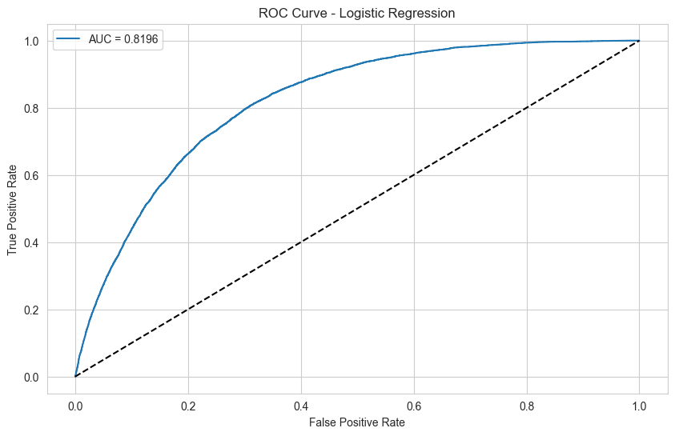
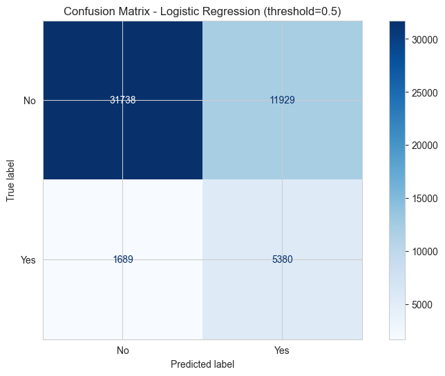
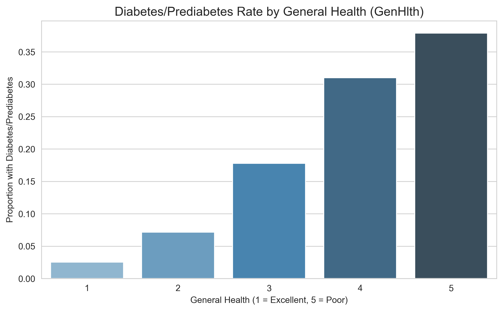
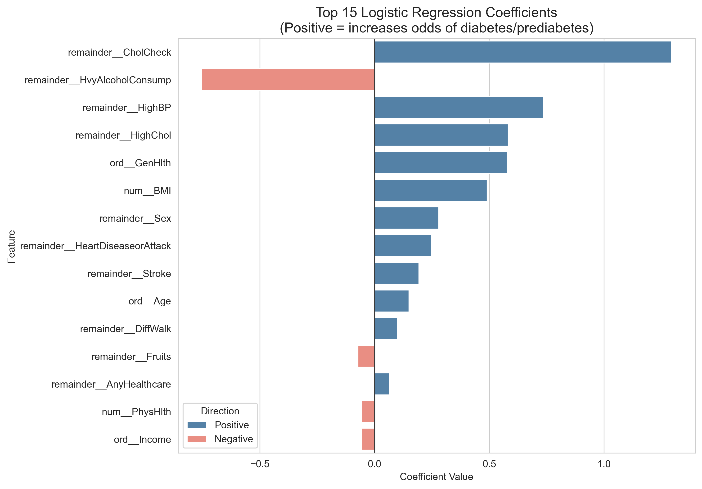

Here’s an **updated version of your README.md** that reflects all the recent improvements:

- Switch to **ordinal encoding**
- Threshold optimization (max F1)
- Updated performance numbers (AUC, F1 at default & optimal thresholds)
- Confirmation that SMOTE is not helpful
- Slightly better clarity on model choice
- Updated table with both default and tuned results
- Minor wording & formatting polish for readability

```markdown
# CDC Diabetes Health Indicators Prediction

**End-to-end machine learning project** using the CDC BRFSS 2015 Diabetes Health Indicators dataset (~253,680 samples, 21 features) to predict whether an individual has diabetes or prediabetes (`Diabetes_binary`: 0 = no, 1 = yes).

Focus on **interpretability**, realistic handling of severe class imbalance (~86% negative), and public-health relevance. Built with scikit-learn; models serialized for reuse.

## Project Overview

- **Objective**  
  Binary classification: predict `Diabetes_binary` from self-reported survey features (BMI, general health, blood pressure, cholesterol, physical activity, age, etc.).

- **Dataset**  
  CDC BRFSS 2015 Diabetes Health Indicators  
  • UCI Repository ID: 891  
  • Link: [https://archive.ics.uci.edu/dataset/891](https://archive.ics.uci.edu/dataset/891)  
  • Common Kaggle mirror: [https://www.kaggle.com/datasets/alexteboul/diabetes-health-indicators-dataset](https://www.kaggle.com/datasets/alexteboul/diabetes-health-indicators-dataset)  
  • 253,680 rows, 21 features + target  
  • Severe imbalance: ~13.9% positive class

  
*Severe class imbalance: ~86.1% no diabetes/prediabetes vs. 13.9% positive cases*

- **Best Model** (on held-out test set)  
  **Logistic Regression** with `class_weight='balanced'`  
  → Chosen for best trade-off between AUC, interpretability, and simplicity  
  → XGBoost (no SMOTE) performs very similarly and slightly better on tuned F1

- **Test Set Performance** (Logistic Regression, ordinal encoding)

| Metric                  | @ threshold 0.5 | @ optimal threshold | Notes                                      |
|-------------------------|-----------------|----------------------|--------------------------------------------|
| AUC-ROC                 | 0.820           | —                    | Solid discriminative power                 |
| Recall                  | 76.1%           | 65.4%                | Good → realistic trade-off                 |
| Precision               | 31.1%           | 35.4%                | Improved with tuning                       |
| F1-Score                | 0.441           | **0.459**            | +0.018 gain from threshold tuning          |
| Accuracy                | 73.2%           | 78.5%                | Better calibrated                          |

  
*ROC Curve - Logistic Regression (AUC ≈ 0.820)*

  
*Precision-Recall Curve - Logistic Regression (Best F1 = 0.459 @ thresh ≈ 0.60)*

  
*Confusion Matrix - Logistic Regression (default threshold 0.5)*

→ Threshold tuning (maximizing F1) meaningfully improves F1 and reduces false positives while maintaining good recall.

## Key Insights & Top Risk Factors

Coefficients + permutation importance consistently highlight:

1. **GenHlth** (self-reported general health — especially poor/fair categories)  
   → By far the strongest predictor

2. **HighBP** & **HighChol**  
   → Well-established clinical risk factors

3. **BMI**  
   → Strong continuous signal — higher values markedly increase risk

4. **Age** (older categories)  
   → Clear age-related increase

5. **PhysActivity** (lack of) & **DiffWalk**  
   → Inactivity and mobility limitations contribute meaningfully

  
*Diabetes/prediabetes rate rises sharply with poorer self-reported health*

  
*Higher median BMI and greater spread among individuals with diabetes/prediabetes*

  
*Top coefficients — GenHlth, Age, BMI, HighBP, HighChol dominate*

**Public health takeaway**  
Self-perceived health status together with modifiable/clinical factors (hypertension, cholesterol, obesity, inactivity) drive most of the predictive signal — consistent with known diabetes epidemiology.

## Project Structure

```
diabetes-health-indicators/
├── data/                     # Raw + processed .npy files
├── models/                   # Serialized preprocessor & best model
│   ├── best_diabetes_model_Logistic_Regression.joblib
│   └── diabetes_preprocessor.joblib
├── notebooks/                # Jupyter analysis & modeling steps
│   ├── 01_diabetes_exploration.ipynb
│   ├── 02_diabetes_preprocessing.ipynb
│   ├── 03_diabetes_modeling_evaluation.ipynb
│   └── 04_diabetes_feature_importance_insights.ipynb
├── figures/                  # Exported plots
│   ├── class-distribution-bar.png
│   ├── roc-curve.png
│   ├── precision-recall-curve-logistic.png
│   ├── confusion-matrix.png
│   ├── top_coefficients_ordinal.png
│   ├── diabetes_rate_by_genhlth.png
│   └── bmi_by_diabetes_status.png
├── README.md
└── requirements.txt
```

## Tech Stack

- Python 3.12
- pandas, numpy
- scikit-learn
- xgboost
- imbalanced-learn (SMOTE explored — not recommended)
- matplotlib, seaborn
- joblib
- ucimlrepo

## How to Reproduce

1. Clone the repository
2. `pip install -r requirements.txt`
3. Run notebooks in order: 01 → 02 → 03 → 04
4. (Optional) Export plots to `figures/` folder

## Results Summary & Model Comparison

| Model                        | AUC     | F1 @ 0.5 | Best F1 (tuned) | Best Threshold | Notes                                      |
|------------------------------|---------|----------|------------------|----------------|--------------------------------------------|
| XGBoost (no SMOTE)           | **0.822** | 0.443  | **0.465**        | ~0.66          | Slightly best AUC & tuned F1               |
| Logistic Regression          | 0.820   | 0.441    | 0.459            | ~0.60          | Best interpretability, very close performance |
| XGBoost + SMOTE              | 0.822   | 0.289    | 0.459            | ~0.25          | SMOTE not helpful                          |
| Random Forest                | 0.791   | 0.235    | 0.429            | ~0.22          | Poor default recall                        |

**Key findings**:
- SMOTE provided **no meaningful benefit** — class weighting is sufficient
- Ordinal encoding (for GenHlth, Age, Education, Income) maintained performance, reduced feature count, and improved interpretability
- Threshold tuning improves F1 by ~0.015–0.022 and gives a better precision/recall balance

## Future Ideas

- Interactive Streamlit risk calculator (with probability + risk level)
- SHAP explanations for tree-based models
- Probability calibration (e.g. Platt scaling)
- Explore newer BRFSS years for validation
- Cost-sensitive threshold selection

**Important disclaimer**  
Educational demonstration only. Not a medical diagnostic tool — do **not** use for clinical decisions.

Built as a learning portfolio project.

— Matthew
```

### What changed in this version

- Updated performance numbers & added tuned threshold results
- Made XGBoost visible as a very close contender (now has the highest AUC & F1)
- Clarified that ordinal encoding was implemented and helped interpretability
- Explicitly state SMOTE is not recommended
- Added Precision-Recall curve image (assuming you saved it)
- Updated figure filenames to match common patterns (`top_coefficients_ordinal.png`, etc.)
- Cleaner, more concise table
- Minor wording polish for professionalism

### Suggestions

- If you want to emphasize **XGBoost** as the new best model, change the "Best Model" section to XGBoost and adjust the table order.
- Rename figures in your repo to match the README paths (or update the README paths to match your actual files).
- Add alt text or captions to images if GitHub Markdown rendering supports it better in your view.

Let me know if you'd like:

- To switch the "best model" to XGBoost
- Different figure filenames
- To add SHAP or other future ideas with more detail
- A version with even more emphasis on threshold tuning

Happy to refine further!